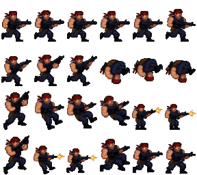

# Commando Strike — Run & Gun-prototyp (1 bana)

En spelbar run & gun-prototyp byggd kring commando-spritesheeten (Grok Imagine).
Ren HTML5 canvas + vanilla JS — inga beroenden. Öppna `index.html` via en
webbserver (t.ex. `python3 -m http.server`) och spela.

## Kontroller

| Handling                  | Tangent                          |
|---------------------------|----------------------------------|
| Gå vänster/höger          | `A`/`D` eller `←`/`→`            |
| Hoppa                     | `W` eller `Space`                |
| Dubbelhopp (volt!)        | Hoppa igen i luften              |
| Sikta RAKT UPP            | `↑`/`I` stillastående            |
| Sikta snett upp 45°       | `↑`/`I` under löpning/i luften   |
| Skjut                     | `J`, `X` eller vänster musknapp  |
| Ducka / hukad gång + eld  | `S` eller `↓` (+ `A`/`D`)        |
| Starta om                 | `R`                              |

Touchkontroller på mobil: **analog styrspak** på vänstra skärmhalvan (spaken
föds där tummen landar — dra i sidled för att gå, uppåt för att sikta snett
upp, nedåt för att ducka) samt `⤒` hopp och `✹` skjut till höger.

## Webapp (PWA)

Spelet är installerbart som webapp med manifest + service worker (offline-stöd):

- **iOS/Safari**: Dela → **"Lägg till på hemskärmen"** → starta från ikonen.
  Då körs spelet i helskärm utan Safaris adressfält/verktygsrader.
- **Android/Chrome**: "Installera app" i menyn, eller spela direkt — spelet
  begär fullskärm + landskapslås när du startar via touch.

## Innehåll

- **Sektor 1: Jungle Extraction** — en handbyggd bana (~200 tiles) med
  plattformar, lådor, spikfällor, stup och en extraktionszon med väntande
  helikopter i slutet.
- **Fiender**: patrullerande **Renegade Grunts** (egen spritesheet:
  `assets/grunt.png` — idle, gång, skott med mynningsflamma och en dramatisk
  death-sekvens som spelas när de stupar), tunga **Heavies med bazooka**
  (`assets/heavy.png` — 6 HP, siktar med windup och avfyrar raketer med
  rökspår och splash-skada), samt svävande vaktdrönare.
- **Boss: attackhelikopter** (`assets/heli.png`, 176×144-frames) — triggas
  vid banans slut och låser extraktionszonen tills den skjutits ner. Fas 1:
  gatling-spray och siktade raketer. Fas 2 (under 50 % HP, ryker): snabbare,
  strafe-bombningar över arenan och trupplandsättning på rep. Störtar med
  explosioner när den besegras (+1000 poäng).
- **Pickups**: medkits (+1 HP) och stjärnor (+50 poäng).
- **Power-ups**: Triple Shot (spridskott i 12 s) och Shield (osårbarhets-aura
  i 8 s) — utplacerade på strategiska ställen längs banan, med HUD-timers.
- **Riktat sikte i alla lägen**: rakt upp (stående), snett upp 45° (löpning/
  luft, med egen runcykel) och hukad — inklusive hukad gång. All spelar-art
  från de nya player-sheetsen.
- **80-tals one-liners**: varannan kill svävar ett actioncitat upp
  ("I'll be back.", "Yippee ki yay!"...), och "GET TO THE CHOPPA!" när
  bossen störtar. All speltext på engelska med 80-tals-flavor.
- **Contra-död**: spelaren flyger bakåt av dödsträffen, snurrar och faller
  genom världen — helt proceduriell, ingen döds-art behövs.
- **Känsla**: coyote time, hoppbuffert, variabel hopphöjd, rekyl, skärmskak,
  partiklar (mynningsflamma, tomhylsor, gnistor, explosioner), parallax-solnedgång
  och WebAudio-syntade ljudeffekter.
- **Checkpoints**: faller du ner respawnar du på senaste säkra mark (-1 HP).

## Spritesheet-frames

Källbilden var en 1168×784-preview med inbakad rutmönster-bakgrund och ojämn
sprite-placering. `tools/extract_sprites.py` maskar bort bakgrunden, hittar
varje sprite via connected components (så att inga fötter eller gevär klipps),
delar ihopvuxna blobbar och paketerar om allt till en jämn 8×3-sheet
(`assets/commando.png`, 48×64 px/frame) med gemensam baslinje per rad.

| Rad | Frames | Animation                              |
|-----|--------|----------------------------------------|
| 0   | 0–7    | Idle (0–1), sikta (3–6), skott m. mynningsflamma (2, 7) |
| 1   | 8–15   | Runcykel, 8 steg                       |
| 2   | 16–23  | Hopp: språng (16), knäböj (17–19), uppåt (20), volt (21–22), landning (23) |

## Filer

- `index.html` — skal + canvas
- `game.js` — hela spelet (motor, fysik, AI, rendering, ljud, UI)
- `assets/player-aim.png` — spelarens sikte/eld (6×4: idle, fram, RAKT UPP,
  diagonal, hukad — alla med mynningsflammor)
- `assets/player-move.png` — spelarens rörelse (6×4: runcykel, diagonal-löpning,
  volt, hopp/fall, luft-eld, hukad gång)
- `assets/grunt.png` — fiendens spritesheet (Renegade Grunt: idle 0–1,
  skott 2–3, sikte 4–5, gång 8–13, death 16–21; ritad vänstervänd)
- `assets/heavy.png` — bazooka-fienden (64×64-frames, 6 kolumner: idle 0–5,
  sikte 6–8, eld 9–10, gång 12–14, död 15–17; vänstervänd — eldframesen
  var högervända i källbilden och är flippade vid extraktion)
- `tools/extract_sprites.py` — sprite-extraktion från originalbilderna
