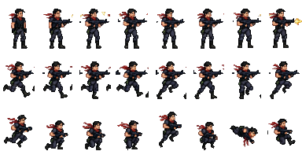

# Commando Strike — Run & Gun-prototyp (1 bana)

En spelbar run & gun-prototyp byggd kring commando-spritesheeten (Grok Imagine).
Ren HTML5 canvas + vanilla JS — inga beroenden. Öppna `index.html` via en
webbserver (t.ex. `python3 -m http.server`) och spela.

## Kontroller

| Handling            | Tangent                          |
|---------------------|----------------------------------|
| Gå vänster/höger    | `A`/`D` eller `←`/`→`            |
| Hoppa               | `W`, `Space` eller `↑`           |
| Dubbelhopp (volt!)  | Hoppa igen i luften              |
| Skjut               | `J`, `X` eller vänster musknapp  |
| Ducka               | `S` eller `↓`                    |
| Starta om           | `R`                              |

Touchkontroller visas automatiskt på mobil.

## Innehåll

- **Sektor 1: Jungle Extraction** — en handbyggd bana (~200 tiles) med
  plattformar, lådor, spikfällor, stup och en extraktionszon med väntande
  helikopter i slutet.
- **Fiender**: patrullerande soldater (samma spritesheet, röd-tintad i runtime)
  som siktar och skjuter i bursts, samt svävande vaktdrönare.
- **Pickups**: medkits (+1 HP) och stjärnor (+50 poäng).
- **Känsla**: coyote time, hoppbuffert, variabel hopphöjd, rekyl, skärmskak,
  partiklar (mynningsflamma, tomhylsor, gnistor, explosioner), parallax-solnedgång
  och WebAudio-syntade ljudeffekter.
- **Checkpoints**: faller du ner respawnar du på senaste säkra mark (-1 HP).

## Spritesheet-frames

Källbilden var en 1168×784-preview med inbakad rutmönster-bakgrund och ojämn
sprite-placering. `tools/extract_sprites.py` maskar bort bakgrunden, hittar
varje sprite via connected components (så att inga fötter eller gevär klipps),
delar ihopvuxna blobbar och paketerar om allt till en jämn 8×3-sheet
(`assets/commando.png`, 48×64 px/frame) med gemensam baslinje per rad.

| Rad | Frames | Animation                              |
|-----|--------|----------------------------------------|
| 0   | 0–7    | Idle (0–1), sikta (3–6), skott m. mynningsflamma (2, 7) |
| 1   | 8–15   | Runcykel, 8 steg                       |
| 2   | 16–23  | Hopp: språng (16), knäböj (17–19), uppåt (20), volt (21–22), landning (23) |

## Filer

- `index.html` — skal + canvas
- `game.js` — hela spelet (motor, fysik, AI, rendering, ljud, UI)
- `assets/commando.png` — ompaketerad spritesheet med alfakanal
- `tools/extract_sprites.py` — sprite-extraktion från originalbilden
